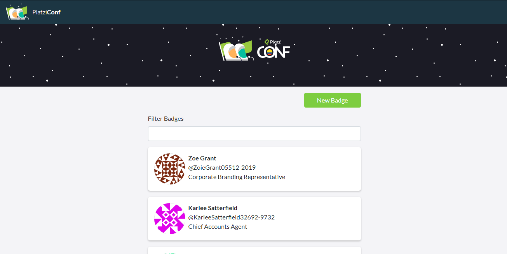

# Platzi-Badges
This is a creator badges in ReactJS

This is a HTML free template to create badges. Made in Reactjs, html5 and css3 with a responsive design.




### Install Dependencies
```
npm install
```

### Starting the Server
Run the next command to launch the development server. 
```
npm start
```

### Building for Production
To build an optimized bundle, run
```
npm run build
```